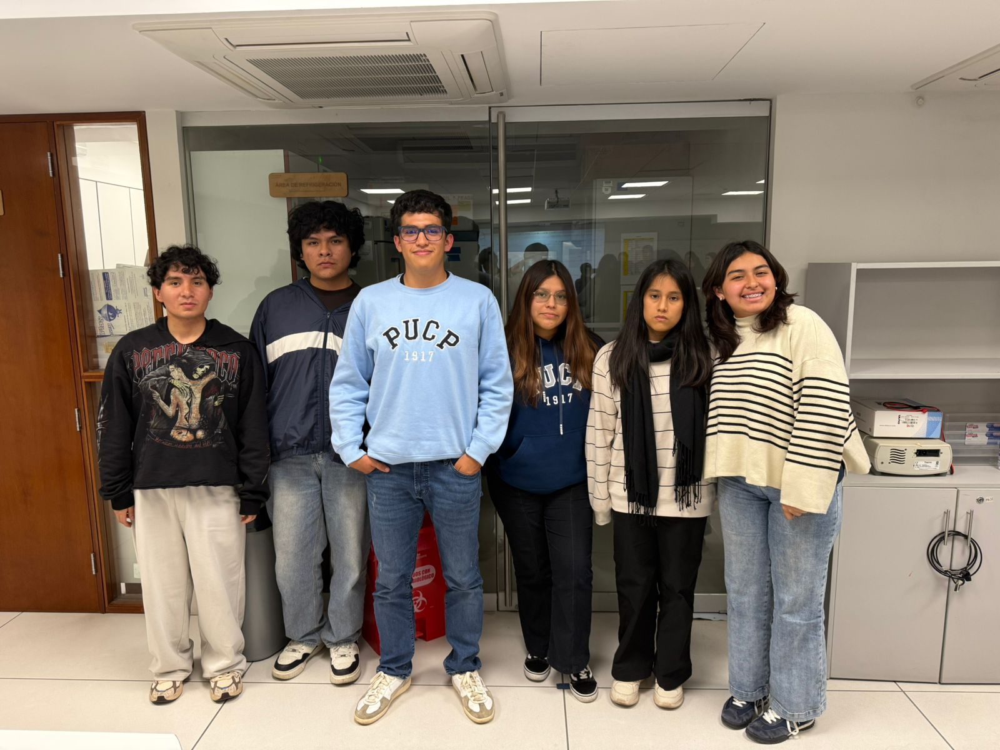
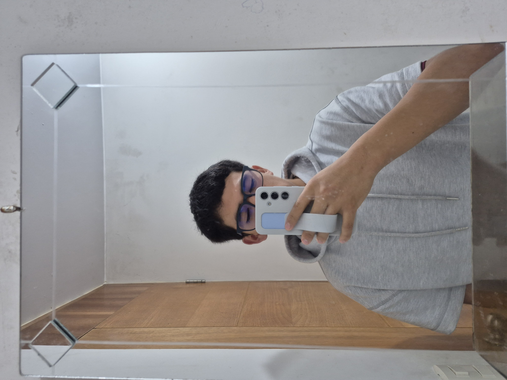

# UNIVERSIDAD PERUANA CAYETANO HEREDIA
## Facultad de Ciencias e Ingenería
### Carrera de Ingenería Biomédica

---

## Fundamentos de Biodiseño

**Integrantes:**  
- Chavez Ramirez, Angela Nikol
- Chumbe Perlacios, Carla Jimena
- Cochachin Falero, Jairo Gonzalo
- Collachagua Jauregui, Arnie Ruben
- Duran Apaza, Xiomara Lindsey
- Estrada Escudero, Fabricio Moises

**Docente:** Juan Zuñiga 
**Ciclo:** 4to Ciclo  
**Fecha:** 20 de agosto de 2025

### **INTEGRANTE 1**

  

**Nombre completo:** Chavez Ramirez, Angela Nikol  
**Edad:** 19  
**Código de estudiante:** 76338798   
**Carrera:** Ingenería Biomédica    
**Correo institucional:** angela.chavez.r@upch.pe   
**Rol en el proyecto:**   
**Habilidades destacadas:** 

### **INTEGRANTE 2**

**Nombre completo:** Chumbe Perlacios, Carla Jimena  
**Edad:** 18    
**Código de estudiante:** 61071807    
**Carrera:** Ingenería Biomédica    
**Correo institucional:** carla.chumbe@upch.pe   
**Rol en el proyecto:**   
**Habilidades destacadas:** 

### **INTEGRANTE 3**

  

**Nombre completo:** Cochachin Falero, Jairo Gonzalo   
**Edad:** 18   
**Código de estudiante:** 60957870   
**Carrera:** Ingenería Biomédica    
**Correo institucional:** jairo.cochachin@upch.pe   
**Rol en el proyecto:**   
 

### **INTEGRANTE 4**

**Nombre completo:** Collachagua Jauregui, Arnie Ruben   
**Edad:** 19   
**Código de estudiante:** 78548992   
**Carrera:** Ingenería Biomédica    
**Correo institucional:** arnie.collachagua@upch.pe   
**Rol en el proyecto:**   
   

### **INTEGRANTE 5**

**Nombre completo:** Duran Apaza, Xiomara Lindsey   
**Edad:** 20   
**Código de estudiante:** 76414112   
**Carrera:** Ingenería Biomédica    
**Correo institucional:** xiomara.duran@upch.pe   
**Rol en el proyecto:**   
 

### **INTEGRANTE 6**

**Nombre completo:** Estrada Escudero, Fabricio Moises   
**Edad:** 18   
**Código de estudiante:** 70635581   
**Carrera:** Ingenería Biomédica    
**Correo institucional:** fabricio.estrada@upch.pe   
**Rol en el proyecto:**   
  