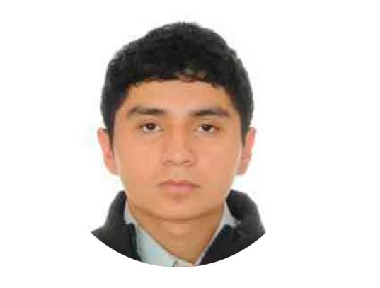

# UNIVERSIDAD PERUANA CAYETANO HEREDIA
## Facultad de Ciencias e Ingenería
### Carrera de Ingenería Biomédica

---

## Fundamentos de Biodiseño

### Proyecto: 

**Integrantes:**  
- Chavez Ramirez, Angela Nikol
- Chumbe Perlacios, Carla Jimena
- Cochachin Falero, Jairo Gonzalo
- Collachagua Jauregui, Arnie Ruben
- Duran Apaza, Xiomara Lindsey
- Estrada Escudero, Fabricio Moises

**Docente:** Juan Zuñiga 
**Ciclo:** 4to Ciclo  
**Fecha:** 20 de agosto de 2025

**Integrante 1**

### **Nombre completo:** Chavez Ramirez, Angela Nikol  
### **Código de estudiante:** 761038798  
### **Carrera:** Ingenería Biomédica  
### **Correo institucional:** angela.chavez.r@upch.pe  
### **Rol en el proyecto:**  
### **Habilidades destacadas:**  

- 

**Integrante 2**

**Nombre completo:** Chumbe Perlacios, Carla Jimena  
**Código de estudiante:** 61071807   
**Carrera:** Ingenería Biomédica    
**Correo institucional:** carla.chumbe@upch.pe   
**Rol en el proyecto:**   
**Habilidades destacadas:**    
- 

**Integrante 3**

  

**Nombre completo:** Cochachin Falero, Jairo Gonzalo  
**Código de estudiante:** 60957870   
**Carrera:** Ingenería Biomédica    
**Correo institucional:** jairo.cochachin@upch.pe   
**Rol en el proyecto:**   
**Habilidades destacadas:**  

**Integrante 4**

**Nombre completo:** Collachagua Jauregui, Arnie Ruben  
**Código de estudiante:** 78548992   
**Carrera:** Ingenería Biomédica    
**Correo institucional:** arnie.collachagua@upch.pe   
**Rol en el proyecto:**   
**Habilidades destacadas:**    

**Integrante 5**

**Nombre completo:** Duran Apaza, Xiomara Lindsey  
**Código de estudiante:** 76414112   
**Carrera:** Ingenería Biomédica    
**Correo institucional:** xiomara.duran@upch.pe   
**Rol en el proyecto:**   
**Habilidades destacadas:**    

**Integrante 6**

**Nombre completo:** Estrada Escudero, Fabricio Moises  
**Código de estudiante:** 70635581   
**Carrera:** Ingenería Biomédica    
**Correo institucional:** fabricio.estrada@upch.pe   
**Rol en el proyecto:**   
**Habilidades destacadas:**    